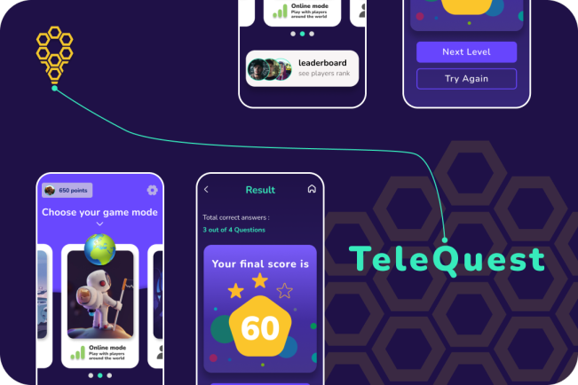

# TeleQuest - An online quiz game

The main idea of our project is to make an educative game app, which is gonna
help theplayers to learn more about James Webb Space Telescope, and also to have fun
while playing, and to challenge other players to answer Quick questions about the
telescope.
The game is gonna be a quiz game, but not any quiz game, it's gonna be a quiz game with
many play modes, and many features, such as:
1) ### Solo mode: where the player will play:
- alone, and answer questions about the telescope, in short time, and get
points, to rank up.
2
- with a friend, and answer Quick questions about the telescope, by the
principle of "first click, first answer".
2) ### Online mode: where the player will challenge another one 1v1 to answer a quick
questions about the telescope, by the principle of "first click, first answer". and
the winner will get points, and rank up.

## Download the app: [Click HERE](https://raw.githubusercontent.com/aymendn/TeleQuest/main/app-release.apk)